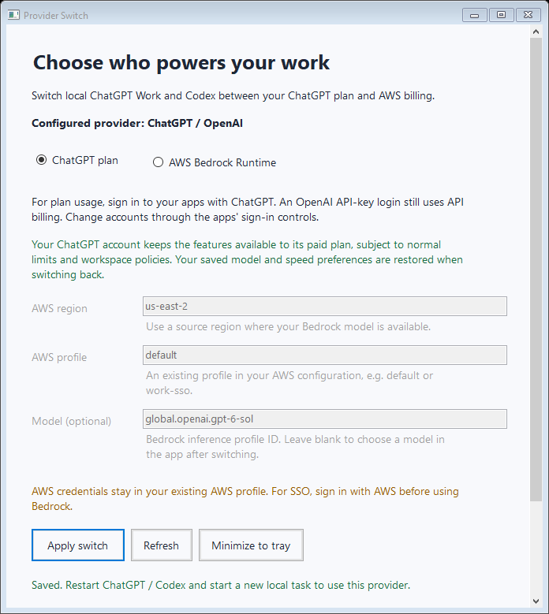

# Native Windows validation

The application was built and executed on GitHub Actions **Windows Server 2022**, reporting OS version **Microsoft Windows 10.0.20348**. The workflow completed successfully on September 30, 2026.

- [Successful Windows run](https://github.com/Deepak8858/chatgpt-bedrock-switcher/actions/runs/36683616190)
- Tested source commit: [`e4b79f8`](https://github.com/Deepak8858/chatgpt-bedrock-switcher/commit/e4b79f8cd23f4315c3f591e3b29e94d4dcd64866)
- [Download the Windows-built app and check runner](https://github.com/Deepak8858/chatgpt-bedrock-switcher/actions/runs/36683616190/artifacts/11082976023) (GitHub sign-in required; retained until October 30, 2026)
- [Download the original test evidence](https://github.com/Deepak8858/chatgpt-bedrock-switcher/actions/runs/36683616190/artifacts/11083180737)

| Check | Result | Report |
| --- | --- | --- |
| Native Windows configuration suite | 32 passed, 0 failed, 0 skipped | [JSON](test-results/2026-09-30/configuration-test-report.json) |
| Independent Python TOML verification | 50 passed, 0 failed | [JSON](test-results/2026-09-30/independent-toml-report.json) |
| Native Windows form/tray smoke tests | 8 passed, 0 failed | [JSON](test-results/2026-09-30/windows-ui-test-report.json) |
| Windows app and test-runner builds | Passed with warnings treated as errors | Workflow build step |
| Packaging and artifact upload | Passed | Workflow artifact links above |

The GUI checks ran the actual Windows executable and exercised initial form loading, provider selection, Apply, restoration of the OpenAI model and Fast-tier preference, invalid-input handling, Refresh, tray-menu actions, and hiding/reopening the window. The screenshot below was captured from that execution and visually inspected.

Configuration checks used isolated temporary directories. They included preservation of unrelated settings and synthetic login data, repeated switches, corrupt-state rejection, concurrent access, encoding handling, and injected write failures with rollback.

## Scope of verification

These are real Windows application and filesystem tests, with programmatic UI control activation. They do not verify authentication to a real ChatGPT account, paid-plan entitlements, running ChatGPT/Codex client processes, live AWS Bedrock inference, IAM permissions, model access or billing. The workflow contains no account credentials and makes no inference requests.

Provider changes still require restarting the official clients and starting a new local Work/Codex task. Bedrock does not inherit ChatGPT subscription-only features. Windows 10 and Windows 11 were not separate runners in this run; the native test host was Windows Server 2022.
